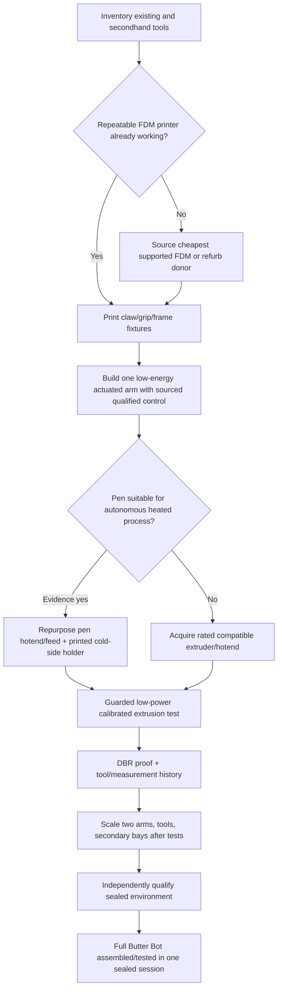

# PrintCeptor first-acquisition logic — inspect / salvage / print / purchase / qualify
**State:** owner-review acquisition matrix, 2026-10-09. No purchase authorised, no hardware verified present and no electronic, thermal, pressure or medical process qualified. This derivative is in PrintSpace PR #6; do not change PMX, UTP, CGX, CCC or canonical owner authority.

## Founder-owned baseline and first spend correction (2026-10-09)
**Superseding equipment availability:** Founder confirms **Dremel 4300 rotary tool OWNED**, **no FDM printer**, **no 3D pen**, several unspecified components **on hand but uncounted**, and a **small workbench/workspace available to establish**, not yet confirmed built. See [founder asset baseline](FOUNDER_WORKSHOP_ASSET_BASELINE_2026-10-09.json) and use `K-FOUNDER-CURRENT`, `K-FOUNDER-FIRST-FDM`, `K-FOUNDER-FDM-PEN-LATER` in the [inverse compiler](printceptor_inverse_compiler.py). The generic tool totals elsewhere in this historic document are **not** the founder's current shopping list because they include a second rotary tool. No inventory label constitutes independently tested condition.

**Immediate recommended purchase comparison (source snapshots; AUD):** [Creality AU Ender-3 V3 SE](https://store.creality.com/au/products/ender-3-v3-se-3d-printer) A$259, stated **220 × 220 × 250 mm** build volume; [Bambu AU A1 mini](https://au.store.bambulab.com/products/a1-mini) A$329, **180 × 180 × 180 mm**; [Bambu A1 Australian reseller list](https://3dbro.com.au/pages/bambu-lab-price-list-australia) A$429, manufacturer **256 × 256 × 256 mm**. These listings do not establish stock or the cheapest landed cost on purchase day. Do not purchase a pen yet: select a compatible commercial hotend versus pen salvage only after first-arm thermal, power/duty, controller and mechanical specifications are known. For the current cost-first path, a verified working second-hand FDM or the Ender-3 V3 SE remains suitable; the larger Bambu A1 is a conditional higher-budget alternative. Avoid purchasing another rotary bit set unless the current **Dremel 4300 exact attachments/consumable state** shows a function-specific deficiency.

**Initial workshop zoning:** a stable measured bench and service space with separate FDM hot-operation area, Dremel dust/debris/manual finishing area, low-voltage electronics assembly/testing area, clean parts storage, optional recovered-component/quarantine tray, safely accessible mains power/thermal shutdown and ventilation appropriate to the selected material and work. Confirm footprint, cables, guarded working access, electrical/PPE/bench loads before installation; numeric bench size remains **UNMEASURED**. Printing PLA/PETG prototypes does not justify work with reactive fumes, medical ingredients, pressure chambers or unsupervised robotic operations.

**Reverse acquisition logic:** inspect already owned fasteners, motors, rails, sensors, power, controllers, calipers, PPE and assorted hardware before treating them as purchasable. Measure, label, and photo only the relevant donor parts in a local/private inventory and bind findings to CGX family references and future DBR. Assign `unverified on hand` until condition and manufacturer ratings are read back, never set price to zero for missing unknown items. The first verified FDM output should be a simple registration/calibration coupon and low-load fixture before printing an articulated arm; initial single-arm assembly remains externally manually operated/guarded until motor/thermal C0 controls are independently commissioned.

---

## Functional specification comes before a shopping category
For any target bit, first distinguish **geometry**, **material**, **function**, **loads**, **exposure**, **control**, **legal/clinical/industrial required grade**, **measured evidence**, **consumables**, **availability**, and **ownership**. Two source listings may have the same thread/shape but fail identical chemical resistance, biocompatibility, surface finish, cleaning, sterilisation, leakage, pressure, fatigue or provenance. A culinary nozzle cannot be assumed equivalent to a medical/clinical nozzle because their apertures look the same. *Shop as a substitute only after the destination's evidence gate has been satisfied.*

## Initial decision sequence — minimum unavoidable expenditure
| ID | When to acquire | Item or source | Can existing equipment substitute? | Safety/evidence hold | Role it unlocks |
|---|---|---|---|---|---|
| A-00 | FIRST, zero new cost if owned | Inventory/measure donor 3D printer, 3D pen, rotary, hand tools, fasteners, old electronics, rails/actuators, surplus construction kits, general discount-store containers | Yes, source as recovered; keep make/model, tests, condition, cost, source ID | No assumed ownership; thermal/electric/safety items subject to test | Grounded availability and prices |
| A-01 | If no usable working printer | Entry FDM (example Creality Ender-3 V3 SE AU listing A$259) or verified used FDM | Used compatible machine lower purchase possible but **actual quote unknown** | Functional axis/nozzle/bed electrical and frame tests | First repeatable PLA/PETG prototype shells, frame clips, jigs, grippers |
| A-02 | Before mechanical tests | Basic PPE, measuring/caliper, inspection, low-voltage power, guarded bench, thermometry/independent thermal cutoff as needed | Existing well-maintained gear or verified alternative first | No hazardous motion/heated pen until rated supply/over-temp protection in place | Measurable safe test bed |
| A-03 | If pen conversion is beneficial | Donor PLA/ABS pen (Jaycar 3D pen example A$79.95; 0.6mm/230°C maximum listed; verify actual duty rating) | Repurpose already owned pen or buy commercial hotend/extruder assembly instead | Inspect original thermal control/heater/sensor, drive, supply, continuous-duty, wiring and EMI; do not power bare heater by generic motor driver | Mountable extrusion candidate, not qualified print head yet |
| A-04 | When first frame/joints are printed | Low-energy stepper/servo with known datasheet, driver, bearing/shaft, limit switch, E-stop/controller | Salvage printer/CNC axes with tested wear, current/torque and verified firmware | Test stationary and no-heat low-power motion, travel and limit protection; first robot arm is not automatic 4D printer | One controlled arm with repeatable pose |
| A-05 | After A-04 passes | Printed cooling-cold-side pen tool clamp, strain relief, cable raceway, calibration block, sample mount | Print from first FDM, or manually make bracket | Heat isolation and tool-change retention/protection | Robot-mounted pen/print head; first functional hybrid learning node |
| A-06 | Before using hot end on arm | Calibrated temperature sensing, heater cutoff/interlock, isolated power, guarded build cell; feed control matched to pen | Reuse tested original pen closed-loop electronics where compatible and legal | No firmware override of thermal cutoff; failure-safe stop on sensor/power fault | Guarded first toolpath with metrology/provenance |
| A-07 | Conditional after demonstrated usefulness | Second arm, enclosed electronics, cam/scanner, feeder, toolchanger, material conditioning | Print frames/grips/guides; source active joints/ICs as needed | Multi-axis collision/force/heat review | Two-arm PrintCeptor bootstrap |
| A-08 | LAST and separately authorised | Professionally engineered transparent sealed vacuum/gas process enclosure, pumps, monitoring, certified pressure parts | Only independently documented/recertified components, not discount-store acrylic by appearance | Qualified chamber/chemical/electrical/operator hazard controls | Controlled multi-environment fabrication |
| A-09 | After qualified source machine | Butter Bot CAD-source and BOM components | Print shells/claws/fixtures; procure or recover verified motors, protected power, electronics | Source rights, functional safe test, sealed-session handling | First complete integrated article |

**Example observed prices (AUD, 9 Oct 2026):**
- [Creality AU Ender-3 V3 SE](https://store.creality.com/au/products/ender-3-v3-se-3d-printer): A$259 at observed listing; availability/discounts vary.
- [Jaycar TL4582 adjustable-temperature 3D pen](https://www.jaycar.com.au/high-temp-pla-3d-pen-kit/p/TL4582): A$79.95; 0.6 mm nozzle and up to 230°C in seller specification, not evidence of safe automated duty cycle.
- [Bunnings Ozito 42-piece rotary](https://www.bunnings.com.au/ozito-42-piece-170w-rotary-tool-kit_p6290175): A$54.98, for **manual finishing**, not an automatic CNC spindle.
These prices are vendor snapshots and *not* a cheapest verified whole-machine BOM. Tool kit `K-FDM-PEN-ARM` stores only these three partial quotations. No postage, consumables, sensors, electronics, fasteners, enclosures, refurbishment labour, inspection or insurance is priced. All combined project cost fields remain unknown.

## Equivalent-by-function evaluation (including dollar shops and donor harvest)
For **every** alternative, maintain candidate row with:
`source category [already-owned / reused / secondhand / cheap retail / industrial retail / purchased rated / custom printed]`;
`price and evidence date`;
`geometry + thread + dimensions`;
`material alloy/polymer and heat exposure`;
`chemical/cleaning compatibility`;
`contact category [none / food / skin / patient]`;
`electrical, load and safety rating`;
`life/wear and traceable manufacturer/lot`;
`processing modifications`;
`energy and human time to transform`;
`acceptance checks`;
`source, measured cost, authorisation and DBR`.
**Hard rule:** Equal outline does NOT mean equal temperature, air-tightness, electrical insulation, sterility, biocompatibility, structural load, pressure or medical usability. Use the cheapest *evidenced compatible* option, retaining all other branches and their failures/unknowns. Sometimes an old printer used as a donor can supply four axes, bearings, limit switches, casing and boards; disassembly/recertification cost must be compared to buying these separately, including lost printer production value.

## Example lowest-equipment evolution

- **First arm:** a lower-cost *step*, not proof the founder's intended two-arm architecture has been relaxed. It is an implementation ladder: 0 → 1 → 2+ installed arms.
- **Repurposing the pen:** remove ergonomic housing and redundant manual triggers only if the core heater, thermistor/thermocouple, feed motor/nozzle, supply and cutoff can safely run under qualified deterministic control. Use printed **cold-side** holder rather than an untested all-plastic hotend retainer. Many consumer pens are not designed for unattended duty; a purchased low-cost hotend may score better after actual risk/time/parts pricing.
- **Software override/manual:** a user-authorised host/controller/firmware replacement may turn an otherwise manual input into deterministic machine operation *only where electronics, safety and legal permissions support it*. Do not disable over-temp sensors, motor hard limits, OEM protective circuits, mains insulation or medical/food restrictions. Manual mode must remain documented as manual, not counted as fully automated single-session output.
- **Donor component test:** visual inspection + part label/manual + electrical isolation/continuity + motor rating and measured performance + physical compatibility and safe restoration path. Discount retailers are candidates for benign fixings, bins, clamps, organisers, consumables and noncritical jigs; not qualified pressure/medical/electrical substitutes without proof.
- **Performance:** choose tool configuration by energy, time, risk, repairability, repeatability and price as a Pareto set. The lowest capital price may be dominated by rework and unqualified process variance.

## CGX links and next receipt interfaces
`source listing/donor item → global type reference → measured instance child & parent CGX device → alternative route decision with why selected/rejected → tool/material qualification → process job and configured WorkSpace → inspection/assembly evidence DBR → capability delta on owning device`.
Use current `C0` independent deterministic physical safety, `C1` local planning and `C2` optional remote CGX coordination. Existing UTP G1 and Post-Mix owners hold underlying function/material equations; this matrix is only PrintSpace purchasing/application policy.

**Acceptance needed from owner:** inventoried equipment and photographs/datasheets of any donor machines/pen/motors; actual local tool price quotes and operating range; physical hazards/licensed process needs. Nothing in this file authorises new purchases, hardware disassembly or local machine actuation.
